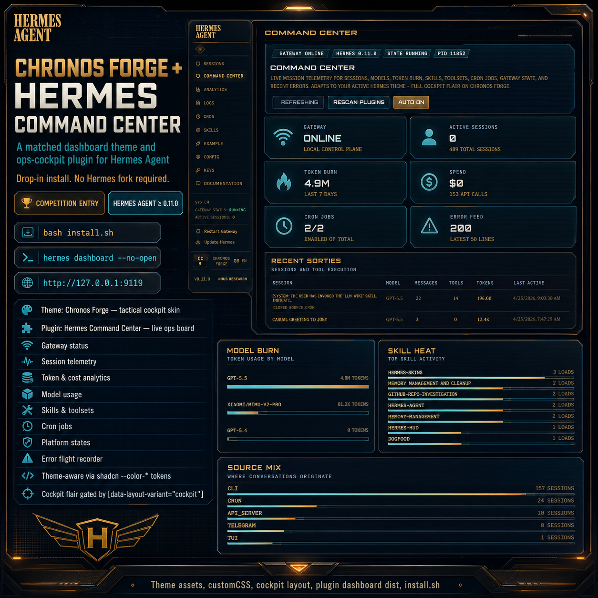
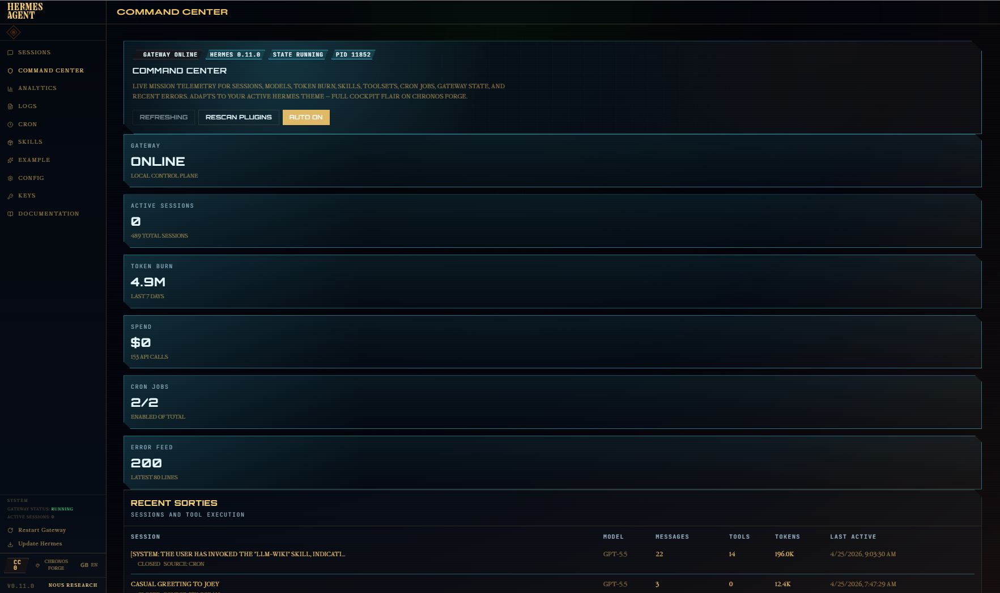
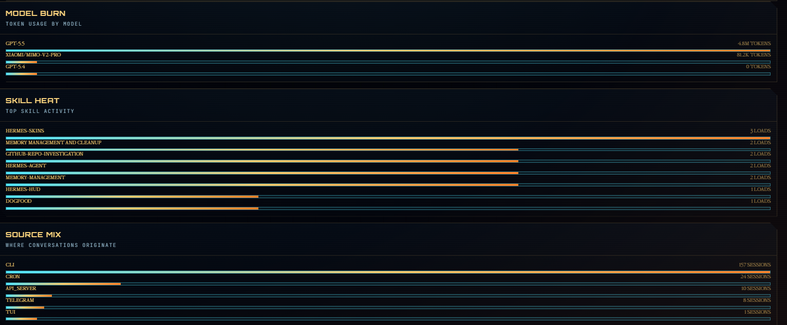

# Chronos Forge + Hermes Command Center







A matched dashboard theme and ops-cockpit plugin for [Hermes Agent](https://github.com/NousResearch/hermes-agent). Drop-in install, no Hermes fork required.

- **Theme**: `Chronos Forge` — tactical cockpit skin (amber command glow, cyan telemetry, scanline texture, compact controls).
- **Plugin**: `Hermes Command Center` — live ops board surfacing gateway status, sessions, token burn, model usage, skills/toolsets, cron jobs, platform states, and an error flight recorder.

## Why this works on every theme

The Command Center plugin reads colors from the shadcn `--color-*` tokens that Hermes sets per theme, so its UI inherits whatever theme is active and stays readable across Hermes Teal, Midnight, Ember, Mono, Cyberpunk, Rosé — anywhere. The cockpit-only flair (clip-path bevels, scanline animation, grid texture, tri-stop progress gradient) is gated behind `[data-layout-variant="cockpit"]`, so it lights up automatically on Chronos Forge (and any other cockpit-variant theme) and stays out of the way otherwise.

## Install

```bash
bash install.sh
```

This copies:

- `themes/chronos-forge.yaml` → `~/.hermes/dashboard-themes/chronos-forge.yaml`
- `plugins/hermes-command-center/dashboard/` → `~/.hermes/plugins/hermes-command-center/dashboard/`

Then start the dashboard:

```bash
hermes dashboard --no-open
```

Open `http://127.0.0.1:9119`, pick **Chronos Forge** from the theme picker, and click the new **Command Center** tab (after Sessions).

If the dashboard was already running before install, hot-rescan instead of restarting:

```bash
curl -X POST http://127.0.0.1:9119/api/dashboard/plugins/rescan
```

## Plugin features

The `/command-center` tab gives you:

- **Gateway** — online/offline, Hermes version, gateway state, PID, active sessions
- **Session telemetry** — recent sessions, model used, message count, tool-call count, token totals, last active
- **Token & cost analytics** — 7-day burn, estimated/actual spend, API call count, per-model token usage
- **Cron control panel** — scheduled jobs, enabled/paused state, next-run time, trigger/pause/resume from the tab
- **Skills & toolsets** — enabled-skill count, configured-toolset count, active toolsets, capability roster
- **Platform states** — connected platforms from gateway status, error highlighting
- **Error flight recorder** — recent error logs surfaced without digging through `~/.hermes/logs/`
- **Shell slots** — header-right Command Center badge, sidebar Mission HUD (cockpit-only), overlay scanline

## Theme details

`Chronos Forge` uses:

- `layoutVariant: cockpit`
- Compact density
- Orbitron / Rajdhani / JetBrains Mono via `fontUrl`
- Palette: deep navy background, amber midground, cyan foreground, warm-orange glow
- Component overrides for card, header, sidebar, tab, badge, progress, backdrop, page
- Custom assets: command grid, crest, logo, header gradient, sidebar gradient
- `customCSS` for scanlines, animated telemetry grid, angular cards, high-contrast hover

## Compatibility

- Hermes Agent ≥ 0.11.0 (dashboard plugin loader at `~/.hermes/plugins/<name>/dashboard/`)
- Tested against the dashboard on port 9119 (default)

## File layout

```
themes/chronos-forge.yaml
plugins/hermes-command-center/dashboard/manifest.json
plugins/hermes-command-center/dashboard/dist/index.js
plugins/hermes-command-center/dashboard/dist/style.css
plugins/hermes-command-center/dashboard/plugin_api.py
install.sh
```

## Uninstall

```bash
rm -rf ~/.hermes/plugins/hermes-command-center
rm -f  ~/.hermes/dashboard-themes/chronos-forge.yaml
curl -X POST http://127.0.0.1:9119/api/dashboard/plugins/rescan
```

## License

MIT
